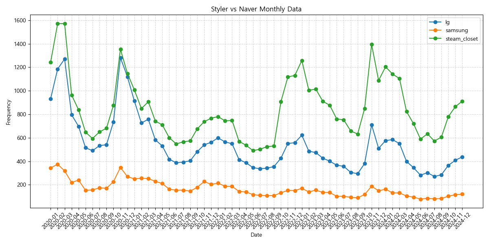
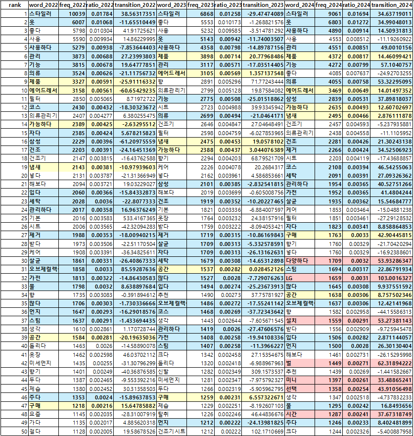
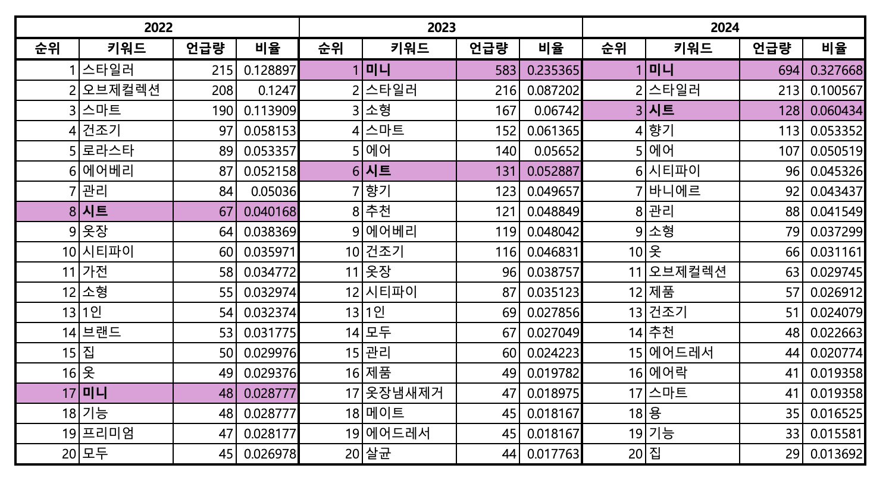
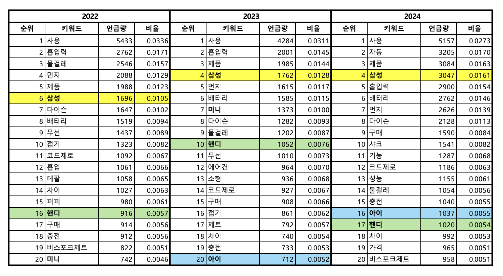
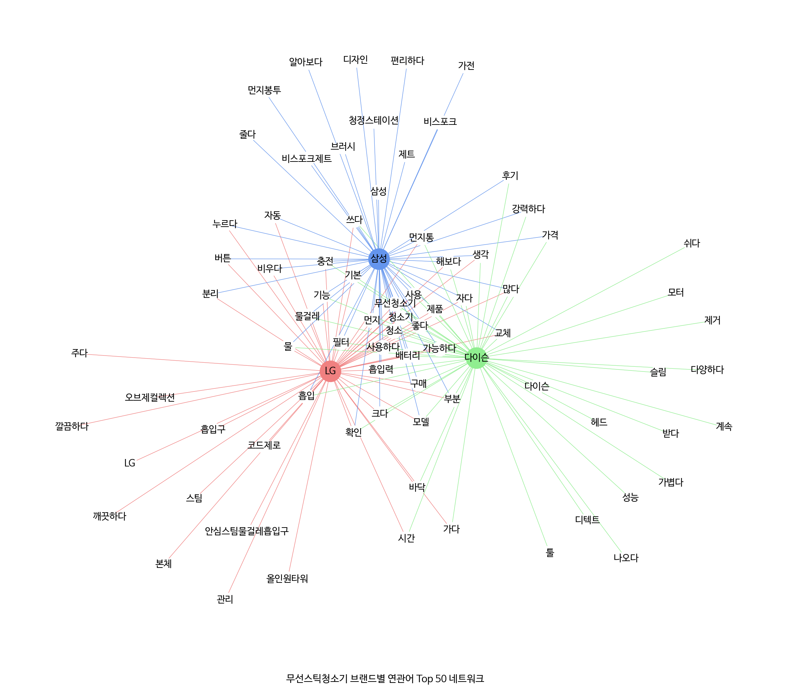

# LG전자 제품 VOC 텍스트 마이닝

[](https://python.org)
[]()
[]()

> 산학협력 | 4인 팀 | 의류관리기·무선스틱청소기·로봇청소기 3개 제품군 · 3개년(2022~2024) · 약 5만여 건 수집 · 빈도·시계열·감정·브랜드 비교·세부기능 연관성 분석

---

## 🎯 핵심 발견

* AI 모델 게시글에서 스마트 기능 관련 키워드 비중이 일반 모델 대비 두드러지게 높음 — AI 모델 특화 연관어 분포 확인
* 의류관리기 '미니' 키워드가 2022~2024 지속 등장 — 소형 의류관리기 수요 신호 포착
* 무선청소기 '핸디' 키워드 반복 등장 — 스틱형과 별개로 핸디형에 대한 독립 수요 축 존재 확인
* 편의성 관련 긍정어 비율이 2024년 크게 증가 — AI 가전 확산에 따른 사용 경험 인식 변화 반영
* 브랜드별(LG·삼성·다이슨) 차별화된 연관어 분포 확인 — 공통 키워드 외 브랜드 고유 소비자 인식 구조 파악

---

## 📌 프로젝트 배경

* 가정학 계열 연구실의 LG전자 산학협력 과제에 텍스트 마이닝 분석 파트로 참여
* AI 가전 라인업 확대 시점에서 일반 모델과 AI 모델 간 소비자 인식 차이, 경쟁 브랜드 대비 포지셔닝을 소비자 자연 언어 기반으로 파악할 필요
* 내부 설문이나 단순 리뷰 집계만으로는 연도별 트렌드 변화와 키워드 수준 세밀 분석 어려움
  * 공개 블로그·카페·유튜브 대규모 수집 및 형태소 기반 텍스트 마이닝 접근 채택

---

## 🔍 분석 설계

**분석 질문**

* 공개 블로그·카페·유튜브 게시글에서 AI 가전 소비자 인식을 연도별·브랜드별로 정량화할 수 있는가
* 일반 모델과 AI 모델 간 소비자 언어 패턴에 측정 가능한 차이가 존재하는가

**접근 방식**

3개 플랫폼 약 5만여 건 수집 후 형태소 분석 기반 빈도·연관어·감정어 파이프라인 구성 — 네이버 데이터랩 시계열과 NetworkX 브랜드 비교 분석 병행으로 다각도 소비자 인식 탐색

---

## ⚠️ 문제 상황

공개 플랫폼 게시글 기반 분석에서 세 가지 구조적 어려움 존재.

| 문제 | 내용 |
|------|------|
| 노이즈 게시글 비중 | 블로그·카페 특성상 홍보·광고·단순 질문글 비중 높아 유의미 소비자 리뷰 선별 기준 수립 필요 |
| 감정어 목록 부재 | 가전 도메인 특화 감정어 사전 없음 — 수작업으로 감정어 목록 구성 |
| 맥락 파악 부담 | 의외 키워드·증감 키워드 수백 개에 대해 근거 텍스트 수동 추출 및 해석 요구 |

---

## 🛠️ 분석 과정

### 1️⃣ 데이터 수집 & 전처리

**데이터 수집:**
* 네이버 검색 API로 블로그·카페, 구글 Custom Search API로 티스토리, YouTube Data API v3로 유튜브 수집
* 제품별 검색 키워드 설정
  * 의류관리기: 스타일러·에어드레서·AI스타일러·AI에어드레서
  * 무선스틱청소기: LG·삼성·다이슨·AI 무선청소기 포함
  * 로봇청소기: 로봇청소기 일반 키워드
* 수집 규모
  * 의류관리기: 약 22,000건
  * 무선스틱청소기: 약 24,000건
  * 로봇청소기: 약 4,000건

**전처리 목적:** 소비자 유기 리뷰 데이터만 선정 — 브랜드 공식·SNS·홍보 게시글 제외, 전체 게시글과 AI 언급 게시글 이원화

* KoNLPy Okt 형태소 분석 — 명사·동사·형용사 토큰 추출으로 의미 있는 단어만 분석
* 홍보·판매·질문 게시글 제거 + 300자 미만 단문 제외 — 노이즈 최소화로 유의미 소비자 리뷰 한정
* 전체 게시글과 AI 모델 언급 게시글 이원화 — 일반 모델 vs AI 모델 비교 분석 가능

* 전처리 후
  * 의류관리기: 약 5,000건
  * 무선스틱청소기: 약 6,000건
  * 로봇청소기: 약 2,600건

**결과:**
* 3개 플랫폼 5만여 건 → 전처리 후 1.3만여 건 정제 완료
* 3개년·3개 제품군·일반/AI 모델별 비교 분석 준비 완료

---

### 2️⃣ 텍스트 분석 (빈도·시계열·감정)

**빈도분석:**


* 단일어·Bigram·Trigram 단위 빈도 집계 — 단어 조합의 문맥 반영
* 연도별(2022/2023/2024) 키워드 비율 및 전년 대비 증감률 산출 — 트렌드 변화 포착
* 3개년 연속 증가·24년 신규 등장·감소 키워드 분류 후 증감 키워드에 대해 연관어 심층 분석
* 빈도분석에서 예상 외 키워드(의류관리기 '미니', 무선청소기 '핸디' 등) 포착 — 잠재 수요 신호 탐지
* Pickle 캐싱으로 형태소 분석 결과 저장 — 대용량 텍스트 재처리 비용 절감

**시계열 분석:**



* 네이버 데이터랩 검색량 데이터로 제품별 월별·계절별 검색 패턴 파악 — 외부 데이터로 검증
* 검색 집중 계절 특정 후 해당 기간 게시글 한정해 계절별 키워드 패턴 분석 수행 — 시간대별 소비자 관심 변화 추적

**감정분석:**

* 가전 도메인 특화 감정어 목록 수작업 구성(긍정어·부정어 구분) — 신조어·맥락 의존 표현 포착
* 감정어별 연관어 분석으로 연도별 감정 프로파일 구성 — 감정의 근거가 되는 기능·속성 파악
* 감정어에 따른 연관 키워드 심층 분석 — 소비자 만족도 및 불만족 원인 파악

**결과:**
* 의류관리기: '미니'(소형) 키워드 3개년 연속 상위 등장 → 소형 모델 수요 신호 포착
* 무선청소기: '핸디'(핸디형) 키워드 지속 등장 → 스틱형과 별개의 독립 수요 축 확인
* 편의성 관련 긍정어 2024년 크게 증가 → AI 가전 확산에 따른 사용 경험 개선 인식

---

### 3️⃣ 브랜드·모델·기능 비교 분석

**브랜드·모델 비교:**


* 브랜드별(LG·삼성·다이슨) 및 일반 모델·AI 모델별 게시글 연관어 Top 50을 NetworkX 네트워크 그래프로 구성 — 시각적 구조 파악
* 공통 키워드 및 브랜드·모델별 차별화 키워드 식별 — 경쟁 포지셔닝 차이 확인

**세부 기능 연관성:**

* 제품별 세부 기능 키워드(살균·탈취·스팀 등)에 대해 연관성 분석 수행 — 기능별 소비자 관심도 파악
* 최근 3개년 언급량 증가 연관 키워드 확인 — 신규 기능 수요 포착

**결과:**
* 브랜드별 고유 소비자 인식 구조 파악 — 마케팅 메시지 차별화 기초
* 일반 vs AI 모델 언어 패턴 차이 실증 — AI 가전 특화 기능 소비자 인식 확인
* 신규 기능·수요 신호 발견 — 신제품 기획 참고 자료

---

## 📊 핵심 결과

### 의류관리기

#### 연도별 키워드 증감 분석



* 의류관리기 상위 50개 키워드 연도별 증감 패턴
  * 22→23→24 증가: 에어드레서·냄새·공간·구매 등 핵심 기능 인식 확산
  * 23→24 증가: 스타일러·살균·스팀 등 세밀 기능 관심 증가

#### 의외의 키워드: '미니'



* 의류관리기 연관 키워드 연도별 패턴에서 '미니' 키워드 상위권 반복 등장
* 3개년 연속 상위권 등장 — 소형 의류관리기 수요가 소비자 언어에 지속 반영

#### 살균 기능 트렌드


* 2023→2024 증가 키워드: 세균·바이러스·냄새 등 위생 실효성
* 2024 신규 키워드: 미니·코스·세탁 등 확장 사용 패턴

#### 일반 모델 vs AI 모델 비교


* AI 모델 특화 연관어: 코스·케어·올뉴·구김 등 스마트 기능 키워드 중심
* 일반 모델 연관어: 시트·향기·탈취 등 기본 기능 중심
* 에어드레서·비스포크 등 경쟁 브랜드 키워드 양쪽 클러스터에 등장 — 구매 시 LG vs 삼성 비교 맥락 확인

---

### 무선스틱청소기

#### 연도별 키워드 분석


* 무선청소기 상위 키워드 연도별 증감 패턴
* 흡입력·필터·먼지통 등 성능·유지보수 관련 키워드 3개년 연속 증가

#### 의외의 키워드: '핸디'



* 무선청소기 연관 키워드에서 '핸디' 키워드 2022~2024 지속 등장
* 스틱형 중심 제품군에서 핸디형에 대한 별도 소비자 관심 존재 — 휴대성·흡입력 수요와 연결

#### 감정어 연관 키워드: '편리하다'

| 구분 | 키워드 |
|------|--------|
| 22→23→24 증가 | 충전·청소기·무선청소기·가능하다·보관·기능·무선·관리 |
| 23→24 증가 | 청소·사용·매우·생활 |
| 24 신규 등장 | 사용성·흡입력·성능·제공·디자인·사용자·효율적이다 |

* 2024 신규 등장: 사용성·흡입력·성능·효율적이다 — '편리하다' 표현이 단순 조작 편의에서 성능·효율 평가로 맥락 확장
* 충전·보관·관리 등 유지보수 키워드 3개년 지속 — 무선청소기 편의성 인식의 주요 축

#### 브랜드 비교 분석



무선청소기 브랜드별 특징 (예시):
* LG: 스팀·물걸레·흡입구 등 위생 청소 기능 중심
* 삼성: 청정스테이션·먼지봉투·디자인·편의성 중심
* 다이슨: 슬림·경량·모터·성능·헤드 기술 등 혁신성 강조

---

## 💡 적용 가능성

* 신제품 출시 전략 수립 기초 데이터
  * 소비자가 주목하는 기능·키워드 사전 파악
  * 소형 모델, 핸디형 등 신규 세그먼트 개발 근거

* 마케팅 메시지 최적화
  * 연도별 감정어 변화를 기반으로 광고 카피 방향 설정
  * AI 모델 vs 일반 모델 차별화된 메시지 전략

* 경쟁 브랜드 모니터링
  * 브랜드별 연관어 분포 변화 주기적 추적
  * 포지셔닝 강점·약점 파악

* 동일 파이프라인을 타 제품군(냉장고·TV·에어컨)으로 확장 적용

---

## 📈 한계점 및 향후 연구 방향

**한계점**

* 노이즈 게시글 완전 제거 한계 — 필터링 이후에도 광고성 게시글 일부 잔존 가능
* 감정어 사전 기반 분석 — 사전에 없는 신조어·맥락 의존 감정 표현 포착 불가
* 로봇청소기 표본 수 상대적으로 적음 — 의류관리기·무선청소기 대비 해석 신뢰도 한계
* 단일 시점 수집 — 동일 게시글의 시간 경과에 따른 반응 변화 추적 불가

**개선 방향**

* 단기: 홍보글 필터링 규칙 정밀화
  * 키워드 패턴·URL 구조 기반 필터 추가 적용

* 중기: 감정어 사전 도메인 확장 및 맥락 기반 감정 분류 모델 실험

* 장기: 실시간 크롤링 파이프라인 구축
  * 신제품 출시 전후 키워드 변화 자동 모니터링 체계 확장

---

## 👥 역할

* 네이버·티스토리·유튜브 크롤링 파이프라인 구축 참여
* KoNLPy Okt 형태소 분석 및 연도별 키워드 증감 분석 구현
* Pickle 캐싱으로 대용량 텍스트 재처리 비용 절감
* NetworkX 연관어 네트워크 구성 및 브랜드별·모델별 비교 분석

---

## 🔧 기술 스택

| 분류 | 도구 |
|------|------|
| 데이터 수집 | 네이버 검색 API, 구글 Custom Search API, YouTube Data API v3 |
| 형태소 분석 | KoNLPy Okt |
| 텍스트 분석 | 빈도분석 (Unigram·Bigram·Trigram), 연관어 분석 |
| 네트워크 분석 | NetworkX |
| 시계열 분석 | 네이버 데이터랩 |
| 감정 분석 | 수작업 감정어 사전 기반 분류 |
| 캐싱 | Pickle |
| 시각화 | Matplotlib |

---

## 📁 파일 구조

```text
03_lg_voc/
├── code/
│   ├── crawling/
│   │   ├── blog crawling.ipynb              # 네이버 블로그·카페 수집
│   │   ├── tistory_crawling.ipynb           # 티스토리 수집
│   │   ├── data_pooling.ipynb               # 플랫폼별 데이터 통합
│   │   └── preprocess_1.ipynb               # 전처리 파이프라인
│   ├── 전체 코드_refactored.ipynb           # 빈도·연관어 분석 (리팩터링)
│   ├── 전체 코드_PKL_분석+퍼널+전환.ipynb   # Pickle 캐싱 기반 분석
│   └── LG_VOC_analysis_from_pkl_with_funnel_conv.ipynb  # 최종 통합 분석
├── figs/                                    # 분석 결과 시각화 (7장)
└── README.md
```

---

## 📊 데이터 안내

분석에 사용된 원본 게시글 데이터(네이버 블로그·카페, 티스토리, 유튜브)와 산학협력 최종 보고서는 대외비로 이 레포에 포함되지 않음. 

수집·분석 코드와 시각화 결과만 공개.
